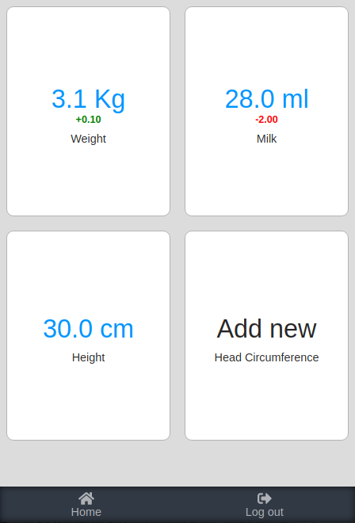
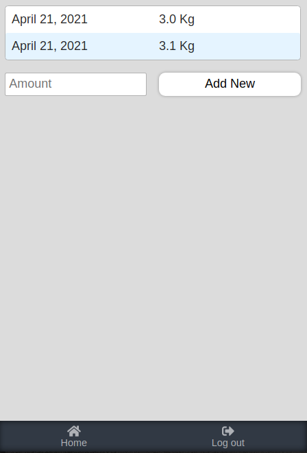

# Baby Measurement Tracker - Front

Baby Measurement Tracker is an App that allows you to keep track of the growth of your baby.\
You can take maeasurements like Weight, Height, Head curcumference and Amount of Milk being drunk.

## Demo Link

https://SuyashFowdar.github.io/baby-tracker-front

## How to use

**Home**

- You have to Sign Up to use the App.
- Once you sign up and you are logged in, you will get a set of items you can measure.
- Tap on the item you wish to add a new measurement, and you will be redirected to the measurement list page.

**Measurement**

- In this page, you will be presented with a set of measurements that and if you have recorded in the past.
- After the list there is a form that you can input new measurements taken.

**Admin**

- There is no button to go to Admin page. You have to manually add `/admin` in the URL.
- You will get access to Admin page only if your account username is 'Admin'.
- In the Admin page, you're able to view all existing items and add new items to measure.

## Screenshots

## Cloning

The following commands must be ran on terminal/CMD:
- In your desired directory, run `git clone https://github.com/SuyashFowdar/baby-tracker-front`.
- Then run `cd baby-tracker-front`.
- From the meow project directory the following scripts can be run.
- Run `npm install` to install all dependencies for the app to run in local

## Available Scripts

In the project directory, you can run:

### `npm start`

Make sure you have the local server(baby-tracker-back) running for smooth running of this project.\
Runs the app in the development mode.\
Open [http://localhost:3000](http://localhost:3000) to view it in the browser. (The port number(3000) might vary depending on whether another process is running on the port.)

The page will reload if you make edits.\
You will also see any lint errors in the console.

### `npm test`

Launches the test runner in the interactive watch mode.\
See the section about [running tests](https://facebook.github.io/create-react-app/docs/running-tests) for more information.

## Built With

- HTML 
- SCSS
- Linter
- JS
- VScode
- React
- Router
- Redux

## Contributing

Contributions, issues and feature requests are welcome! Start by:

  - Forking the project
  - Cloning the project to your local machine
  - cd into the project directory
  - Run git checkout -b your-branch-name
  - Make your contributions
  - Push your branch up to your forked repository
  - Open a Pull Request with a detailed description to the development branch of the original project for a review

## Author

👤 **Suyash Fowdar**

- Github: [@SuyashFowdar](https://github.com/SuyashFowdar)
- Twitter: [@SuyashFowdar](https://twitter.com/SuyashFowdar)
- LinkedIn: [LinkedIn](https://www.linkedin.com/in/suyash-fowdar/)

## Show your Support
Give a ⭐ if you like this project!
